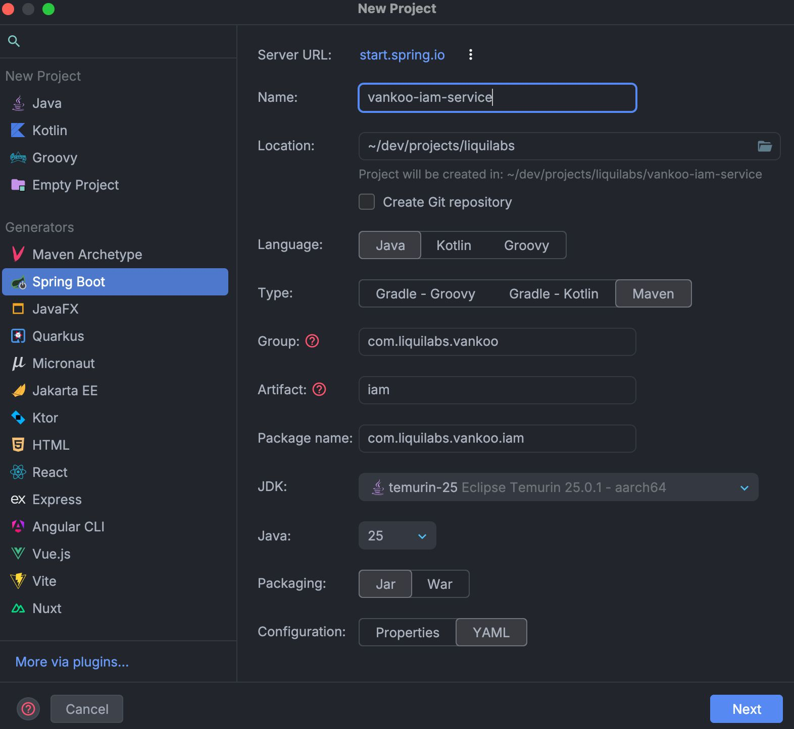
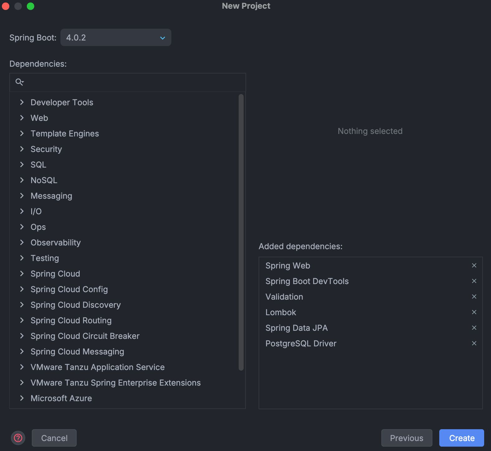

# Configuración del Proyecto

## Creación del Proyecto

Este proyecto se ha creado utilizando la interfaz de IntelliJ IDEA Ultimate, aprovechando su integración con Spring Initializr para configurar rápidamente un proyecto Spring Boot con las dependencias necesarias.

- **Name:** Se eligió `vankoo-iam-service` para reflejar claramente su función dentro del ecosistema de microservicios de Vankoo, enfocándose en la gestión de identidad y acceso.
- **Location:** Idealmente ubicado en el mismo nivel que otros proyectos relacionados, como `vankoo-infra`, para facilitar la gestión del `docker-compose` y la integración entre servicios.
- **Language:** Java, dado que es el lenguaje principal para el desarrollo de microservicios con Spring Boot.
- **Type:** Maven, por su amplia adopción y compatibilidad con Spring Boot, además de facilitar la gestión de dependencias y la construcción del proyecto.
- **Group:** `com.liquilabs.vankoo`, siguiendo la convención de nomenclatura de paquetes en Java (dominio invertido), reflejando la startup (Liquilabs) y el proyecto (Vankoo).
- **Artifact:** `iam`, nombre que refleja claramente la función del servicio dentro del ecosistema de Vankoo, centrado en la gestión de identidad y acceso. Omitimos el sufijo `service` para mantenerlo conciso y coincidir con el nombre del Bounded Context.
- **Package name:** `com.liquilabs.vankoo.iam`, siguiendo la convención de nomenclatura de paquetes en Java, reflejando la estructura del proyecto y su función específica dentro del ecosistema de Vankoo.
- **JDK:** temurin-25, la última versión del JDK, que ofrece mejoras de rendimiento y nuevas características, asegurando que el proyecto esté actualizado y sea compatible con las últimas tecnologías.
- **Java:** 25, para aprovechar las últimas características del lenguaje y garantizar la compatibilidad con el JDK seleccionado.
- **Packaging:** Jar, ya que es el formato estándar para aplicaciones Spring Boot, facilitando su ejecución y despliegue.
- **Configuration:** YAML, por su legibilidad y facilidad de uso para la configuración de Spring Boot, permitiendo una estructura clara y organizada para las propiedades del proyecto.

## Dependencias

Se usó la última versión de Spring Boot (4.0.2) y se seleccionaron las siguientes dependencias para cubrir las necesidades del servicio:

- **Spring Web:** Para construir APIs RESTful y manejar solicitudes HTTP.
- **Spring Boot DevTools:** Para mejorar la experiencia de desarrollo con recarga automática y otras características útiles durante el desarrollo local.
- **Spring Data JPA:** Para facilitar la interacción con la base de datos PostgreSQL utilizando el patrón de repositorio.
- **PostgreSQL Driver:** Para conectar con la base de datos PostgreSQL.
- **Lombok:** Para reducir el código boilerplate, como getters, setters, constructores, etc.
- **Validation:** Para validar las entradas de los usuarios en los endpoints REST.

Posteriormente, se añadieron otras dependencias clave para la funcionalidad específica del servicio, algunas son:

- **Springdoc OpenAPI Scalar:** Para generar documentación de la API REST de manera automática y la integración de Scalar con OpenAPI.
- **Spring Cloud Stream:** Para facilitar la comunicación asíncrona con otros microservicios a través de Kafka.
- **Spring Boot Actuator:** Para exponer endpoints de monitoreo y salud del servicio.
- **Spring Cloud Netflix Eureka Client:** Para permitir que el servicio se registre en el Discovery Server de Eureka, facilitando la comunicación entre microservicios.
- **Spring Security:** Para implementar la autenticación y autorización, especialmente con JWT.
- **jjwt:** Para manejar la creación y validación de tokens JWT (`jjwt-api`, `jjwt-impl`, `jjwt-jackson`).
- **Java UUID Generator:** Para la generación de UUIDs v7.
- **Pluralize:** Para soportar utilidades de pluralización de texto dentro del proyecto (usado para las tablas de la base de datos).
- **LZ4 Java (Override de seguridad):** Para reemplazar la versión vulnerable transitiva y corregir la CVE-2025-66566.
